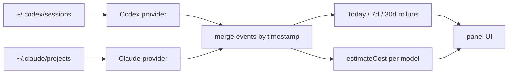

# Tokenfetti

**English** · [中文](README.zh.md)

> A tiny macOS notch widget that watches your local **Codex** and **Claude Code** sessions and shows, in real time, how much your usage would cost at metered API rates. 420×150 panel that hides under the notch handle, always on top, mouse-passthrough, visually quiet — but the numbers dance.


## The story

Some days I burn AI through Pro subscriptions; other days through raw API keys; usually both. Either way the bill stays mostly invisible — flat-rate hides behind "I already paid", and per-token usage surfaces as a vague monthly invoice you barely look at.

The trouble with invisible bills is your brain stops noticing. A Claude Opus refactor that "spends" $4 feels the same as a $0 IDE autocomplete. There's no scoreboard.

**Tokenfetti is the scoreboard.**

It sits in the macOS notch and quietly tallies, every few seconds, what your local sessions would cost at metered API rates. When Claude Opus chews through a 200k-token refactor, the dollar number jumps by $4 and the cost cell shifts one shade warmer. When Codex powers through an overnight job, you wake up to a today total that's already in the gold tier and a panel that quietly threw confetti at $250 while you were asleep.

If you're on Pro plans, the number tells you how much value you're extracting from a flat fee. If you're on API, it's roughly what you'll be charged. Either way the dance is the same: numbers tick, colors warm, confetti bursts on milestones. Tokenfetti is **not** a billing dashboard — it's the visceral knob that turns invisible AI burn into something you can feel.

## What you see

- **Cost is the hero**: the big number on each column is the dollars the metered API would have charged. Tokens are the supporting context, in smaller type underneath
- **Heat coloring**: each cost number takes on a color based on its absolute USD magnitude — cool lavender for light usage, brand violet at moderate, warm amber/gold/red at heavy. Same 11-tier ladder applies to today / 7d / 30d, so the longer windows naturally read warmer (they're cumulative)
- **Today / 7d / 30d** rollups — Codex and Claude Code merged into one running tally
- **Hover for per-provider breakdown**: hover any column and a small box pops out 6px to the right of that cost number, showing the CODEX vs CLAUDE split for that range. Box position tracks the actual rendered width of the cost text, so it always sits flush against the digits regardless of value
- **Wordmark**: lowercase `token` in a brushed-metal vertical gradient (cold "machine" feel) + each `fetti` letter in a different confetti color (warm "celebration" feel). A small radial confetti-burst logo sits at the top-left
- **Cache-aware**: uncached input, cache writes, and cache reads are billed at their real prices, so the number isn't a fairytale
- **Mouse passthrough**: a 185px handle (= 85% of the 14" MBP notch width) sits under the macOS notch; only the handle and the expanded panel capture clicks. The rest of the widget is air
- **Read-only**: no network calls, no telemetry, no auth. It only reads files already on your disk

The widget never talks to OpenAI or Anthropic. It just watches your local session logs and does arithmetic. The dollar figure is an estimate of what the metered API would have charged — for Pro users, the gap between that number and your amortized subscription cost is what you "extracted"; for API users, it's roughly the running tab.

## The dance

Numbers don't just appear — they tick. Each refresh tweens from the previous value over ~600ms, so a $4 jump is something you can feel.

When today's cost crosses certain thresholds, the panel throws a confetti burst from the cost number itself. Three tiers, panel-bound, max ~1.5s, never looping:

| Trigger | Burst |
| --- | --- |
| Single refresh adds ≥ $5 to today | small (18 particles) |
| Today's cost crosses the next $25 / $50 / $100 milestone | medium (36 particles) |
| Today's cost crosses $250 / $500 / $1k / $2.5k / $5k | big (60 particles + today cell flashes gold) |

Each milestone threshold also corresponds to a step in the **cost color ladder** (cool lavender → brand violet → warm amber → red), so a confetti burst doubles as a visible change in the cost cell's color.

If a milestone fires while the panel is closed, it's queued and replayed when you next open the panel — you won't miss the moment because you were heads-down in your editor.

The handle that lives in the macOS notch stays visually quiet on purpose: no motion, no color shifts. The dance only happens in the expanded panel.

The refresh button (top-right of header) carries the entire update-state UX: spins while a refresh is in flight, briefly turns red on failure, otherwise stays muted. There's no separate "UPDATED NOW" status text — the icon does the talking.

## What it reads

| Provider | Default path | What it parses |
| --- | --- | --- |
| Codex | `~/.codex/sessions/**/rollout-*.jsonl` | `event_msg / token_count` cumulative totals → per-turn deltas |
| Claude Code | `~/.claude/projects/**/*.jsonl` | `type: "assistant"` rows with `message.usage`, deduplicated by `message.id` (Claude Code emits one row per content block, all carrying the same usage payload) |

If neither directory exists, the panel just shows zeros — Tokenfetti won't fail, it just won't have anything to celebrate.

## Pricing (USD per 1M tokens)

Lives in [`electron/providers/pricing.js`](electron/providers/pricing.js). These are the prices the widget pretends you're being charged so it can show you the gap.

**Claude (Anthropic public API, 5-minute cache rates):**

| Model | Input | Cache Write | Cache Read | Output |
| --- | ---: | ---: | ---: | ---: |
| Opus 4.5 / 4.6 / 4.7 | $5.00 | $6.25 | $0.50 | $25.00 |
| Opus 4 / 4.1 | $15.00 | $18.75 | $1.50 | $75.00 |
| Sonnet 4 / 4.5 / 4.6 | $3.00 | $3.75 | $0.30 | $15.00 |
| Haiku 4.5 | $1.00 | $1.25 | $0.10 | $5.00 |
| Haiku 3.5 | $0.80 | $1.00 | $0.08 | $4.00 |

**Codex (OpenAI):**

| Model | Input | Cached | Output |
| --- | ---: | ---: | ---: |
| GPT-5.5 | $5.00 | $0.50 | $30.00 |
| GPT-5-Codex | $1.25 | $0.125 | $10.00 |
| GPT-5.4 | $2.50 | $0.25 | $15.00 |
| GPT-5.4-mini | $0.75 | $0.075 | $4.50 |
| GPT-5.3-Codex | $1.75 | $0.175 | $14.00 |
| GPT-5.2 | $1.75 | $0.175 | $14.00 |

**Not modeled:** long-context surcharges, regional uplifts (Anthropic `inference_geo`, Vertex/Bedrock regional), Batch API discount, Anthropic Fast mode, 1-hour cache writes (uses 5-minute as a conservative default). Unknown Codex models fall back to GPT-5.4 pricing; unknown `claude-*` models fall back to Sonnet pricing.

These dollar numbers are local back-of-envelope estimates, not invoices. The point isn't accuracy to the cent; it's the daily hit of watching the numbers rise.

## Install

### From the prebuilt `.dmg`

Get `Tokenfetti-<version>-arm64.dmg` (≈102 MB) from the [latest release](https://github.com/jnzhang-pku/Tokenfetti/releases) — or build it yourself (see below).

**Requirements:**
- macOS 13 or later
- **Apple Silicon (M1 / M2 / M3 / M4)** — the build is arm64-only. Intel Macs need a separate `--x64` build.

**Steps:**
1. Double-click the `.dmg`. A window opens with `Tokenfetti.app` inside.
2. Drag `Tokenfetti.app` into your `Applications` folder.
3. In Applications, **right-click `Tokenfetti` → Open** *(must be right-click on first launch).* The app is ad-hoc signed but not notarized, so a plain double-click triggers a *"developer cannot be verified"* Gatekeeper block. Right-click → Open replaces that with a confirmation dialog that has an **Open** button.
4. Click **Open**. You only do this dance once; subsequent launches work via plain double-click or `open -a Tokenfetti`.

If you'd rather skip the right-click step entirely, strip the quarantine flag:

```bash
xattr -dr com.apple.quarantine /Applications/Tokenfetti.app
```

After that, `open -a Tokenfetti` works directly.

After launching, look at the top-center of your primary display: a small 185×24px handle peeks out from under the macOS notch. Hover it to expand the panel.

### From source

```bash
npm install
npm start
```

A small handle appears at the top center of the primary display under the macOS notch. Hover it to expand the panel.

## Build

```bash
npm run pack:mac      # unsigned .app under dist/mac-arm64/Tokenfetti.app
npm run dist:mac      # .dmg installer under dist/Tokenfetti-<version>-arm64.dmg
```

Install your fresh build locally:

```bash
rm -rf "/Applications/Tokenfetti.app"
ditto "dist/mac-arm64/Tokenfetti.app" "/Applications/Tokenfetti.app"
open -a "/Applications/Tokenfetti.app"
```

Both targets are **ad-hoc signed only** — no Apple Developer Program, no notarization. End users hit the right-click-Open Gatekeeper dance described above on first launch. To make the app launch-on-double-click for end users, you'd need a Developer ID certificate (`$99/yr`) and a notarization step via `electron-builder --publish` so Apple staples a notarization ticket onto the artifact.

## Configuration

| Env var | Effect |
| --- | --- |
| `TOKENFETTI_CLAUDE_ROOT` | Override the Claude Code projects root. Useful if your `~/.claude` lives elsewhere. |

## Verify

Synthetic-data smoke tests, no external dependencies:

```bash
npm run verify:all              # all of the below
npm run verify:claude-parser    # token + cost math against synthetic Claude session
npm run verify:multi            # Codex + Claude flowing through the same buildSummary
```

## How it works



Each provider exposes a `collect()` that returns a stream of normalized usage events `{ timestampMs, model, inputTokens, cacheReadTokens, cacheWriteTokens, outputTokens, totalCost }`. `usageData.js` merges them, buckets by local-day, and produces the IPC payload the widget renders.

Cache accounting:
- **Codex** reports `cached_input_tokens` as a subset of `input_tokens` — uncached input billed at the input rate, cached portion at the cached rate. `reasoning_output_tokens` is reported separately but is already counted inside `output_tokens` (OpenAI convention; verified in session logs where `total_tokens = input_tokens + output_tokens`), so it's billed once via the output rate.
- **Claude** reports three separate populations: `input_tokens` (uncached), `cache_creation_input_tokens` (write, 1.25× input for 5-min cache), `cache_read_input_tokens` (hit, 0.10× input). All three are billed independently.

Claude Code writes one log row per content block in a response (e.g., a single API call that returns `thinking + tool_use` becomes two rows, both carrying the same `message.id` and the same `usage` payload). The parser deduplicates by `message.id` so each API response is billed exactly once — without this dedup, costs were over-counted by ~3x.

## Project map

| Path | Role |
| --- | --- |
| [`electron/main.js`](electron/main.js) | Window placement, always-on-top, hover polling, mouse passthrough |
| [`electron/preload.js`](electron/preload.js) | Safe IPC bridge to the renderer |
| [`electron/usageData.js`](electron/usageData.js) | Multi-provider orchestration, time-window rollup, IPC payload |
| [`electron/providers/pricing.js`](electron/providers/pricing.js) | Unified pricing table (Codex + Claude), four-tier cost estimator |
| [`electron/providers/codex.js`](electron/providers/codex.js) | Codex `rollout-*.jsonl` parser, cumulative-to-delta conversion |
| [`electron/providers/claudeCode.js`](electron/providers/claudeCode.js) | Claude Code `*.jsonl` parser, per-call usage |
| [`src/index.html`](src/index.html), [`src/renderer.mjs`](src/renderer.mjs), [`src/styles.css`](src/styles.css) | Widget UI |

## License

MIT.
