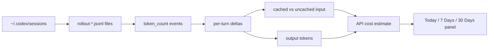

# Token Lens

> A tiny macOS lens for local Codex token usage: always available, visually quiet, and precise about cached-input cost.


Token Lens is a compact Electron widget that sits at the top center of macOS. It reads local Codex session logs, summarizes token usage across useful time windows, and estimates what the same traffic would cost under OpenAI API-style token pricing.

It is intentionally small: a 126px handle when collapsed, a fixed 420px panel when expanded, and mouse passthrough everywhere else so it does not block browser tabs or normal clicks.

## What It Shows

| Window | Metric | Meaning |
| --- | --- | --- |
| Today | Tokens + estimated USD | Usage on the latest local Codex day |
| 7 Days | Tokens + estimated USD | Rolling 7-day usage |
| 30 Days | Tokens + estimated USD | Rolling 30-day usage |

The UI aggregates all models together and labels the dollar value as `API COST ESTIMATE`. It is not Codex billing, not ChatGPT credits, and not an invoice. It is a local estimate based on token counts saved in Codex session files.

## Why It Exists

Codex sessions can be long, cached-heavy, and spread across many local projects. Token Lens gives a quick answer to three questions:

- How much local Codex usage happened recently?
- How much of that input likely benefited from prompt caching?
- What would the equivalent API cost look like under the configured API pricing table?

## How It Works



The parser tracks cumulative token counters in each session file and converts them into deltas. Cached input tokens are treated as a subset of input tokens: cached input is charged at the cached rate, while the remaining input is charged at the normal input rate.

## Pricing Assumptions

Prices live in [electron/usageData.js](electron/usageData.js). Units are USD per 1M tokens.

| Model | Input | Cached Input | Output |
| --- | ---: | ---: | ---: |
| GPT-5.5 | $5.00 | $0.50 | $30.00 |
| GPT-5-Codex | $1.25 | $0.125 | $10.00 |
| GPT-5.4 | $2.50 | $0.25 | $15.00 |
| GPT-5.4-mini | $0.75 | $0.075 | $4.50 |
| GPT-5.3-Codex | $1.75 | $0.175 | $14.00 |
| GPT-5.2 | $1.75 | $0.175 | $14.00 |

Current limitations:

- It does not model long-context surcharges.
- It does not model regional-processing uplifts.
- Unknown model names fall back to GPT-5.4-style pricing.

## Interaction Details

- Collapsed state: only the top-center handle is interactive.
- Expanded state: only the panel itself captures mouse input.
- Transparent window regions use Electron mouse passthrough, so normal app and browser clicks keep working.
- The refresh button re-reads local Codex sessions immediately.

## Run

```bash
npm install
npm start
```

## Build

```bash
npm run pack:mac
npm run dist:mac
```

Build outputs are written to `dist/`.

## Install Locally

```bash
rm -rf "/Applications/Token Lens.app"
ditto "dist/mac-arm64/Token Lens.app" "/Applications/Token Lens.app"
open -a "/Applications/Token Lens.app"
```

## Project Map

| Path | Role |
| --- | --- |
| [electron/main.js](electron/main.js) | Window placement, always-on-top behavior, hover polling, mouse passthrough |
| [electron/preload.js](electron/preload.js) | Safe bridge from renderer to Electron IPC |
| [electron/usageData.js](electron/usageData.js) | Codex session parsing, cached-token-aware cost estimation |
| [src/index.html](src/index.html) | Static widget markup |
| [src/renderer.mjs](src/renderer.mjs) | Refresh logic and metric rendering |
| [src/styles.css](src/styles.css) | Handle and panel styling |
| [assets/token-lens-preview.svg](assets/token-lens-preview.svg) | README product preview |

## 中文说明

Token Lens 是一个放在 macOS 顶部的小型 Codex token 监控组件。它读取本机 `~/.codex/sessions` 下的会话日志，统计 Today、7 Days、30 Days 三个时间窗口的 token 使用量，并按 OpenAI API 单价估算等价成本。

它的重点不是做一个完整仪表盘，而是做一个不打扰工作的轻量提示器：收起时只露出一个小黑色把手；展开后显示三列核心数据；透明区域不会拦截鼠标点击。

成本数字是 `API COST ESTIMATE`：它不是 Codex 实际扣费，也不是 ChatGPT credits，只是把本地 session 里的 token 按 API token 单价折算成美元估算值。
