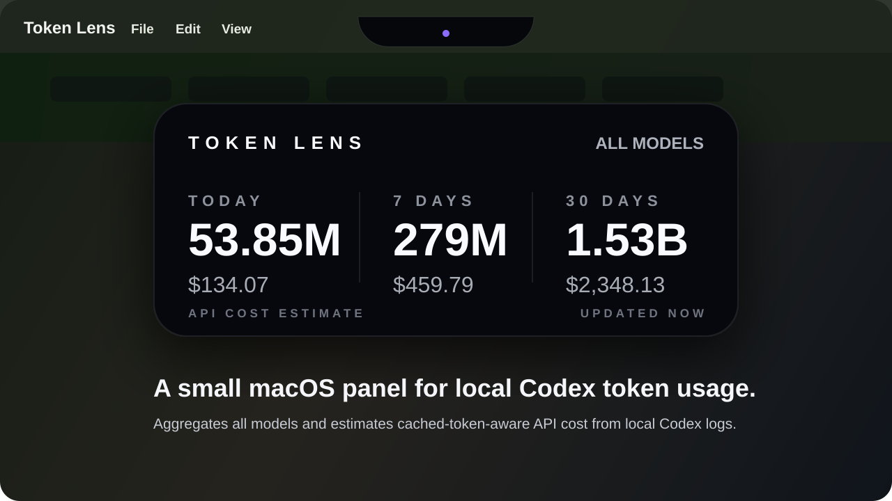
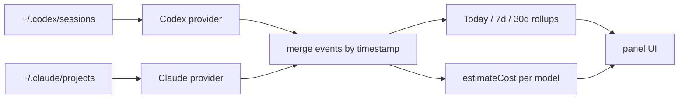

# Token Lens

> A tiny macOS lens for local **Codex** and **Claude Code** token usage. Always on top, visually quiet, mouse-passthrough so it never blocks a click.



Token Lens reads your local agent session logs and shows three numbers: how many tokens you used today, in the last 7 days, and in the last 30 days — plus an estimated USD cost based on each vendor's public API pricing.

It is **not** a billing dashboard. It is a 420×190px Electron widget that lives in the macOS notch area and does one thing.

## What you get

- **Today / 7d / 30d** token totals, merged across all providers in one view
- **Estimated cost** in USD using public API rates (no provider switcher — everything is summed together)
- **Cache-aware**: separates uncached input, cache writes, and cache reads at their actual prices
- **Mouse passthrough**: a 126px handle peeks out of the menubar; only the handle and the expanded panel capture clicks
- **Read-only**: no network calls, no telemetry, no auth. It only reads files you already have on disk

## What it reads

| Provider | Default path | What it parses |
| --- | --- | --- |
| Codex | `~/.codex/sessions/**/rollout-*.jsonl` | `event_msg / token_count` cumulative totals → per-turn deltas |
| Claude Code | `~/.claude/projects/**/*.jsonl` | `type: "assistant"` rows with `message.usage` (per-call, no delta math) |

If neither directory exists, the panel just shows zeros — Token Lens won't fail.

## Pricing

USD per 1M tokens. Lives in [`electron/providers/pricing.js`](electron/providers/pricing.js).

**Claude (Anthropic public API, 5-minute cache rates):**

| Model | Input | Cache Write | Cache Read | Output |
| --- | ---: | ---: | ---: | ---: |
| Opus 4.5 / 4.6 / 4.7 | $5.00 | $6.25 | $0.50 | $25.00 |
| Opus 4 / 4.1 | $15.00 | $18.75 | $1.50 | $75.00 |
| Sonnet 4 / 4.5 / 4.6 | $3.00 | $3.75 | $0.30 | $15.00 |
| Haiku 4.5 | $1.00 | $1.25 | $0.10 | $5.00 |
| Haiku 3.5 | $0.80 | $1.00 | $0.08 | $4.00 |

**Codex (OpenAI):**

| Model | Input | Cached | Output |
| --- | ---: | ---: | ---: |
| GPT-5.5 | $5.00 | $0.50 | $30.00 |
| GPT-5-Codex | $1.25 | $0.125 | $10.00 |
| GPT-5.4 | $2.50 | $0.25 | $15.00 |
| GPT-5.4-mini | $0.75 | $0.075 | $4.50 |
| GPT-5.3-Codex | $1.75 | $0.175 | $14.00 |
| GPT-5.2 | $1.75 | $0.175 | $14.00 |

**Not modeled:** long-context surcharges, regional uplifts (Anthropic `inference_geo`, Vertex/Bedrock regional), Batch API discount, Anthropic Fast mode, 1-hour cache writes (uses 5-minute as conservative default). Unknown Codex models fall back to GPT-5.4 pricing; unknown `claude-*` models fall back to Sonnet pricing.

The dollar number is labeled `API COST ESTIMATE` for a reason — it's a local back-of-envelope, not an invoice.

## Run from source

```bash
npm install
npm start
```

You'll see a small handle at the top center of your primary display. Hover it to expand the panel.

## Build a `.app`

```bash
npm run pack:mac      # unsigned .app under dist/mac-arm64/
npm run dist:mac      # .dmg installer under dist/
```

Install locally:

```bash
rm -rf "/Applications/Token Lens.app"
ditto "dist/mac-arm64/Token Lens.app" "/Applications/Token Lens.app"
open -a "/Applications/Token Lens.app"
```

## Configuration

| Env var | Effect |
| --- | --- |
| `TOKEN_LENS_CLAUDE_ROOT` | Override the Claude Code projects root. Useful if your `~/.claude` lives elsewhere. |

## Verify

Synthetic-data smoke tests, no external dependencies:

```bash
npm run verify:all              # all of the below
npm run verify:claude-parser    # token + cost math against synthetic Claude session
npm run verify:multi            # Codex + Claude flowing through the same buildSummary
```

## How it works



Each provider exposes a `collect()` that returns a stream of normalized usage events `{ timestampMs, model, inputTokens, cacheReadTokens, cacheWriteTokens, outputTokens, totalCost }`. `usageData.js` merges them, buckets by local-day, and produces the IPC payload the widget renders.

Cache accounting:
- **Codex** reports `cached_input_tokens` as a subset of `input_tokens` — uncached input billed at the input rate, cached portion at the cached rate.
- **Claude** reports three separate populations: `input_tokens` (uncached), `cache_creation_input_tokens` (write, 1.25× input for 5-min cache), `cache_read_input_tokens` (hit, 0.10× input). All three are billed independently.

## Project map

| Path | Role |
| --- | --- |
| [`electron/main.js`](electron/main.js) | Window placement, always-on-top, hover polling, mouse passthrough |
| [`electron/preload.js`](electron/preload.js) | Safe IPC bridge to the renderer |
| [`electron/usageData.js`](electron/usageData.js) | Multi-provider orchestration, time-window rollup, IPC payload |
| [`electron/providers/pricing.js`](electron/providers/pricing.js) | Unified pricing table (Codex + Claude), four-tier cost estimator |
| [`electron/providers/codex.js`](electron/providers/codex.js) | Codex `rollout-*.jsonl` parser, cumulative-to-delta conversion |
| [`electron/providers/claudeCode.js`](electron/providers/claudeCode.js) | Claude Code `*.jsonl` parser, per-call usage |
| [`src/index.html`](src/index.html), [`src/renderer.mjs`](src/renderer.mjs), [`src/styles.css`](src/styles.css) | Widget UI |

## License

MIT.

---

### 中文说明

Token Lens 是一个放在 macOS 屏幕顶部的小型 token 用量监控组件，同时统计本地 **Codex**（`~/.codex/sessions`）和 **Claude Code**（`~/.claude/projects`）的 token 使用，按 OpenAI 与 Anthropic 公开 API 价格估算成本，合并展示在一个面板里——不区分 provider，看到的就是总数。

特点：
- 收起时只露出一个 126px 小把手，几乎不打扰；展开后是 420×190 的固定面板
- 透明区域不拦截鼠标点击，正常工作时感觉不到它的存在
- 完全只读本地文件，无网络请求、无遥测、无登录

价格只是"估算"——不是 Codex/Claude 的实际账单，也不是订阅扣费，只是把本地 session 里的 token 数按 API 单价折算。
