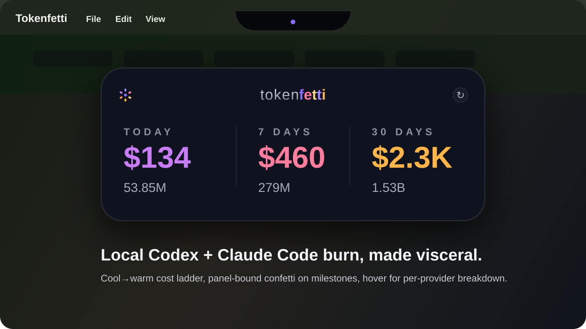
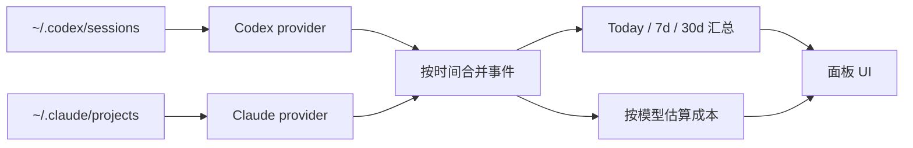

# Tokenfetti

[English](README.md) · **中文**

> 一个藏在 macOS 刘海下的小组件，盯着你本机的 **Codex** 与 **Claude Code** 会话，按计费 API 单价实时折算成美元。420×150 面板，常驻屏幕顶端，鼠标穿透，视觉极轻——但数字会跳舞。



## 故事

有些天我用 Pro 订阅烧 AI，有些天直接用 API key，多数时候两者都用。无论哪种，账单都基本是看不见的——包月躲在"我已经付过了"后面，按 token 计费则变成月底一张你瞄一眼就关掉的发票。

看不见的账单的麻烦在于：你大脑会**停止在意**。Claude Opus 跑一次"花了 $4"的重构，感觉跟 IDE autocomplete 跑出 $0 的字样没区别。没有计分板。

**Tokenfetti 就是那个计分板。**

它静静待在 macOS 的"刘海"区域，每隔几秒就计算一次：你本机的 session 如果按计费 API 算要多少钱。Claude Opus 啃完一次 20 万 token 的重构——美元数字跳 $4，cost 单元的颜色再暖一档。Codex 跑完一个通宵任务——你醒来看到今日总额已经是金色档，面板在你睡着时悄悄在 $250 关卡放过烟花。

如果你是 Pro 用户，这个数字告诉你你从包月里榨出了多少价值。如果你是 API 用户，这就是你大约要被收的钱。无论哪种，舞蹈是一样的：数字滚动、颜色升温、跨过里程碑就放烟花。Tokenfetti **不是**账单仪表盘——它是把"看不见的 AI 烧"翻译成你能感受到的东西的那个旋钮。

## 你能看到什么

- **美元是主角**：每列上方的大字是"如果按计费 API 算会花多少钱"，token 数作为副标在下方小字显示
- **色温染色**：每个美元数字按绝对消耗值上 11 档色阶——浅紫（轻量）→ 品牌紫（中量）→ 琥珀/金/红（重量）。三个时间窗共用同一张色阶表，更长的窗口（累计值更大）天然读起来更暖
- **Today / 7d / 30d** 三档汇总——Codex 与 Claude Code 合并到同一个跑表里
- **Hover 看分供应商明细**：把鼠标放在任一 cost 数字上，右侧 6px 处弹出一个小方框，显示 CODEX vs CLAUDE 的拆分。方框位置跟着 cost 数字的实际宽度动态贴合，永远紧贴数字右边，不管是 `$0.42` 还是 `$1.23M`
- **Wordmark**：小写 `token` 用钛金属纵向渐变（冷的"机器"感）+ `fetti` 五个字母各上一个 confetti 色（暖的"庆祝"感）。左上角一颗径向 confetti 烟花 logo
- **缓存感知**：未缓存输入、缓存写入、缓存命中分别按各自真实价格计费，数字不是童话
- **鼠标穿透**：菜单栏下方藏着一个 185px 的小把手（按 14" MBP 刘海宽度的 85% 制定）；只有把手和展开后的面板会捕获点击，其余地方都是空气
- **完全只读**：无网络请求、无遥测、无登录，只读你本机已有的文件

组件**从不**联系 OpenAI 或 Anthropic 的服务器，它只读你本机的会话日志再算数。那个美元数字是"如果按计费 API 算会花多少钱"的估算——Pro 用户看的是"你从包月里挖出多少"，API 用户看的是"你大约欠了多少"，两边都成立。

## 跳动

数字不是直接刷出来的——它们会"滚"。每次刷新用 ~600ms 缓动从旧值过渡到新值，让一次 $4 的跳动你能感受到。

当今日成本跨过某些关卡时，面板会从美元数字位置喷出一小撮 confetti。三档强度，仅在面板内、最长约 1.5s、绝不循环：

| 触发 | 烟花强度 |
| --- | --- |
| 单次刷新今日新增 ≥ $5 | small（18 颗） |
| 今日成本跨过 $25 / $50 / $100 关卡 | medium（36 颗） |
| 今日成本跨过 $250 / $500 / $1k / $2.5k / $5k | big（60 颗 + today cell 闪金） |

每个关卡同时也是 **成本色阶**（冷紫 → 品牌紫 → 琥珀 → 红）的一档跨越，所以放烟花的同时 cost 单元的颜色也会跳一档。

如果里程碑在面板关闭时触发，会被记下，等你下次打开面板时补放——你专注写代码时错过的好消息，等你回来再看也来得及。

藏在 macOS 刘海里的把手刻意保持安静：不动、不变色。跳舞只发生在展开后的面板里。

右上角的刷新按钮承担了所有"刷新状态"的 UX：刷新中转动，失败时短暂变红，平时安静。没有单独的"UPDATED NOW"文字——按钮自己说话。

## 它读什么

| Provider | 默认路径 | 解析内容 |
| --- | --- | --- |
| Codex | `~/.codex/sessions/**/rollout-*.jsonl` | `event_msg / token_count` 累积总数 → 按轮次差分 |
| Claude Code | `~/.claude/projects/**/*.jsonl` | `type: "assistant"` 行携带的 `message.usage`，按 `message.id` 去重（Claude Code 把一次 API 响应里的每个 content block 都各写一行，但都带同样的 usage 数值） |

如果两个目录都不存在，面板显示 0，不会报错——只是没什么好庆祝的。

## 价格（USD per 1M tokens）

定义在 [`electron/providers/pricing.js`](electron/providers/pricing.js)。这就是组件假装在收你钱的那张表，好让它能给你看出"差额"。

**Claude（Anthropic 公开 API，5 分钟缓存价）：**

| 模型 | Input | 缓存写入 | 缓存命中 | Output |
| --- | ---: | ---: | ---: | ---: |
| Opus 4.5 / 4.6 / 4.7 | $5.00 | $6.25 | $0.50 | $25.00 |
| Opus 4 / 4.1 | $15.00 | $18.75 | $1.50 | $75.00 |
| Sonnet 4 / 4.5 / 4.6 | $3.00 | $3.75 | $0.30 | $15.00 |
| Haiku 4.5 | $1.00 | $1.25 | $0.10 | $5.00 |
| Haiku 3.5 | $0.80 | $1.00 | $0.08 | $4.00 |

**Codex（OpenAI）：**

| 模型 | Input | 缓存输入 | Output |
| --- | ---: | ---: | ---: |
| GPT-5.5 | $5.00 | $0.50 | $30.00 |
| GPT-5-Codex | $1.25 | $0.125 | $10.00 |
| GPT-5.4 | $2.50 | $0.25 | $15.00 |
| GPT-5.4-mini | $0.75 | $0.075 | $4.50 |
| GPT-5.3-Codex | $1.75 | $0.175 | $14.00 |
| GPT-5.2 | $1.75 | $0.175 | $14.00 |

**未建模的部分**：长上下文加价、区域加价（Anthropic `inference_geo`、Vertex/Bedrock 区域端点）、Batch API 50% 折扣、Anthropic Fast 模式 6× 加价、1 小时缓存写入价（统一按 5 分钟价处理，更保守）。未识别的 Codex 模型按 GPT-5.4 兜底；未识别的 `claude-*` 模型按 Sonnet 兜底。

这些美元数字是本地折算，不是真账单。重点不是精确到分，而是每天扫一眼，看到数字往上爬带来的那点儿小爽。

## 安装

### 从预编译 `.dmg`

从 [latest release](https://github.com/jnzhang-pku/Tokenfetti/releases) 下载 `Tokenfetti-<版本>-arm64.dmg`（约 102 MB），或者本地自己 build（见下面 Build 段）。

**要求：**
- macOS 13 或更高
- **Apple Silicon（M1 / M2 / M3 / M4）**——只打了 arm64，Intel Mac 需要额外打 `--x64` 版本

**步骤：**
1. 双击 `.dmg`，弹出磁盘映像窗口里有 `Tokenfetti.app`
2. 把 `Tokenfetti.app` 拖到你的 `Applications` 文件夹
3. 在 Applications 里**右键 `Tokenfetti` → 打开**（首次启动**必须右键**）。这个 app 是 ad-hoc 签名但**没经过 Apple Notarization**，普通双击会被 Gatekeeper 拦下来弹"无法验证开发者"的对话框，只有 "Move to Trash" 按钮。右键 → 打开 会换成一个有 **Open** 按钮的确认对话框
4. 点 **Open**。这套动作只做一次；以后双击或 `open -a Tokenfetti` 都能直接启动

不想右键的另一条路——直接清掉 quarantine 标记：

```bash
xattr -dr com.apple.quarantine /Applications/Tokenfetti.app
```

清完之后 `open -a Tokenfetti` 直接就能启。

启动后看主屏幕顶部正中：一个 185×24px 的把手从 macOS 刘海下方探出来。把鼠标移上去面板就展开了。

### 从源码

```bash
npm install
npm start
```

启动后，主屏幕顶部中央会出现一个小把手藏在刘海下方，把鼠标移上去面板就会展开。

## 打包

```bash
npm run pack:mac      # 未签名 .app，输出到 dist/mac-arm64/Tokenfetti.app
npm run dist:mac      # .dmg 安装包，输出到 dist/Tokenfetti-<版本>-arm64.dmg
```

本地安装刚 build 出的版本：

```bash
rm -rf "/Applications/Tokenfetti.app"
ditto "dist/mac-arm64/Tokenfetti.app" "/Applications/Tokenfetti.app"
open -a "/Applications/Tokenfetti.app"
```

两种产物都是**只 ad-hoc 签名**——没买 Apple Developer Program、没走 notarization。所以下载后的用户首次启动都得过一遍上面"右键 → 打开"的 Gatekeeper 流程。要让用户双击直接开，需要 Developer ID 证书（$99/年）+ `electron-builder --publish` 跑 notarization 拿到 Apple 盖戳的产物。

## 配置

| 环境变量 | 作用 |
| --- | --- |
| `TOKENFETTI_CLAUDE_ROOT` | 覆盖 Claude Code 的 projects 根目录。如果你的 `~/.claude` 不在默认位置，用这个。 |

## 验证

合成数据冒烟测试，无外部依赖：

```bash
npm run verify:all              # 跑下面所有
npm run verify:claude-parser    # 用合成 Claude session 校验 token + 成本数学
npm run verify:multi            # Codex + Claude 同时进入 buildSummary
```

## 工作原理



每个 provider 暴露一个 `collect()`，输出统一格式的事件流：`{ timestampMs, model, inputTokens, cacheReadTokens, cacheWriteTokens, outputTokens, totalCost }`。`usageData.js` 合并这些事件，按本地日切桶，最后产出渲染所需的 IPC payload。

缓存的处理方式：
- **Codex** 把 `cached_input_tokens` 当作 `input_tokens` 的子集——未缓存部分按 input 价计费，缓存部分按 cached 价计费。`reasoning_output_tokens` 单独报告但**已经包含在 `output_tokens` 里**（OpenAI 约定，已通过 session log 实测验证：每个 token_count 都有 `total_tokens = input_tokens + output_tokens`），所以只按 output 单价算一次。
- **Claude** 把输入分成三个独立池：`input_tokens`（未缓存）、`cache_creation_input_tokens`（缓存写入，5 分钟缓存按 1.25× input）、`cache_read_input_tokens`（缓存命中，按 0.10× input）。三者各自独立计费。

Claude Code 把一次 API 响应里的每个 content block（thinking / tool_use / text 等）都各写成一行 jsonl——所有行共用同一个 `message.id` 和同一份 `usage`。Parser 按 `message.id` 去重，确保一次 API 响应只计费一次——没有这条去重时，成本会被多算 ~3 倍。

## 项目结构

| 路径 | 作用 |
| --- | --- |
| [`electron/main.js`](electron/main.js) | 窗口位置、置顶行为、悬停轮询、鼠标穿透 |
| [`electron/preload.js`](electron/preload.js) | 渲染层与 Electron IPC 之间的安全桥接 |
| [`electron/usageData.js`](electron/usageData.js) | 多 provider 编排、时间窗汇总、IPC payload |
| [`electron/providers/pricing.js`](electron/providers/pricing.js) | 统一价格表（Codex + Claude）、四档成本估算器 |
| [`electron/providers/codex.js`](electron/providers/codex.js) | Codex `rollout-*.jsonl` 解析、累积转差分 |
| [`electron/providers/claudeCode.js`](electron/providers/claudeCode.js) | Claude Code `*.jsonl` 解析、每次调用增量 |
| [`src/index.html`](src/index.html), [`src/renderer.mjs`](src/renderer.mjs), [`src/styles.css`](src/styles.css) | 小组件 UI |

## License

MIT.
