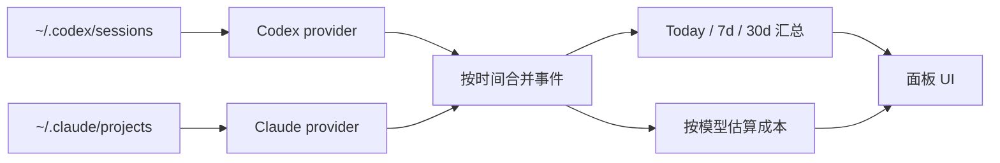

# Token Lens

[English](README.md) · **中文**

> 一个小巧的 macOS token 用量观察镜，同时支持本地 **Codex** 与 **Claude Code**。常驻屏幕顶端，视觉极轻，鼠标穿透——不会挡住任何点击。


Token Lens 读取你本机的 agent 会话日志，给出三个数字：今天、最近 7 天、最近 30 天的 token 用量；并按各家公开 API 价格估算等价美元成本。

它**不是**一个账单仪表盘。它是一个 420×190px 的 Electron 小组件，安静地待在 macOS 屏幕顶部"刘海"位置，只做一件事。

## 你能看到什么

- **Today / 7d / 30d** 的 token 总量，所有 provider 合并到一个视图里
- **估算成本**，按各家公开 API 单价（没有 provider 切换器，所有数字都是合并后的总和）
- **缓存感知**：把"未缓存输入 / 缓存写入 / 缓存读取"按各自实际价格分开计费
- **鼠标穿透**：菜单栏下露出一个 126px 的小把手，只有把手和展开后的面板会捕获点击
- **完全只读**：无网络请求、无遥测、无登录，只读你本机已有的文件

## 它读什么

| Provider | 默认路径 | 解析内容 |
| --- | --- | --- |
| Codex | `~/.codex/sessions/**/rollout-*.jsonl` | `event_msg / token_count` 累积总数 → 按轮次差分 |
| Claude Code | `~/.claude/projects/**/*.jsonl` | `type: "assistant"` 行携带的 `message.usage`（每次调用增量，无需差分） |

如果两个目录都不存在，面板显示 0，不会报错。

## 价格

USD per 1M tokens。定义在 [`electron/providers/pricing.js`](electron/providers/pricing.js)。

**Claude（Anthropic 公开 API，5 分钟缓存价）：**

| 模型 | Input | 缓存写入 | 缓存命中 | Output |
| --- | ---: | ---: | ---: | ---: |
| Opus 4.5 / 4.6 / 4.7 | $5.00 | $6.25 | $0.50 | $25.00 |
| Opus 4 / 4.1 | $15.00 | $18.75 | $1.50 | $75.00 |
| Sonnet 4 / 4.5 / 4.6 | $3.00 | $3.75 | $0.30 | $15.00 |
| Haiku 4.5 | $1.00 | $1.25 | $0.10 | $5.00 |
| Haiku 3.5 | $0.80 | $1.00 | $0.08 | $4.00 |

**Codex（OpenAI）：**

| 模型 | Input | 缓存输入 | Output |
| --- | ---: | ---: | ---: |
| GPT-5.5 | $5.00 | $0.50 | $30.00 |
| GPT-5-Codex | $1.25 | $0.125 | $10.00 |
| GPT-5.4 | $2.50 | $0.25 | $15.00 |
| GPT-5.4-mini | $0.75 | $0.075 | $4.50 |
| GPT-5.3-Codex | $1.75 | $0.175 | $14.00 |
| GPT-5.2 | $1.75 | $0.175 | $14.00 |

**未建模的部分**：长上下文加价、区域加价（Anthropic `inference_geo`、Vertex/Bedrock 区域端点）、Batch API 50% 折扣、Anthropic Fast 模式 6× 加价、1 小时缓存写入价（统一按 5 分钟价处理，更保守）。未识别的 Codex 模型按 GPT-5.4 兜底；未识别的 `claude-*` 模型按 Sonnet 兜底。

面板上写的是 `API COST ESTIMATE`——这是个本地折算，不是真账单。

## 从源码运行

```bash
npm install
npm start
```

启动后，主屏幕顶部中央会出现一个小把手，把鼠标移上去面板就会展开。

## 打包成 `.app`

```bash
npm run pack:mac      # 未签名的 .app，输出到 dist/mac-arm64/
npm run dist:mac      # .dmg 安装包，输出到 dist/
```

本地安装：

```bash
rm -rf "/Applications/Token Lens.app"
ditto "dist/mac-arm64/Token Lens.app" "/Applications/Token Lens.app"
open -a "/Applications/Token Lens.app"
```

## 配置

| 环境变量 | 作用 |
| --- | --- |
| `TOKEN_LENS_CLAUDE_ROOT` | 覆盖 Claude Code 的 projects 根目录。如果你的 `~/.claude` 不在默认位置，用这个。 |

## 验证

合成数据冒烟测试，无外部依赖：

```bash
npm run verify:all              # 跑下面所有
npm run verify:claude-parser    # 用合成 Claude session 校验 token + 成本数学
npm run verify:multi            # Codex + Claude 同时进入 buildSummary
```

## 工作原理



每个 provider 暴露一个 `collect()`，输出统一格式的事件流：`{ timestampMs, model, inputTokens, cacheReadTokens, cacheWriteTokens, outputTokens, totalCost }`。`usageData.js` 合并这些事件，按本地日切桶，最后产出渲染所需的 IPC payload。

缓存的处理方式：
- **Codex** 把 `cached_input_tokens` 当作 `input_tokens` 的子集——未缓存部分按 input 价计费，缓存部分按 cached 价计费。
- **Claude** 把输入分成三个独立池：`input_tokens`（未缓存）、`cache_creation_input_tokens`（缓存写入，5 分钟缓存按 1.25× input）、`cache_read_input_tokens`（缓存命中，按 0.10× input）。三者各自独立计费。

## 项目结构

| 路径 | 作用 |
| --- | --- |
| [`electron/main.js`](electron/main.js) | 窗口位置、置顶行为、悬停轮询、鼠标穿透 |
| [`electron/preload.js`](electron/preload.js) | 渲染层与 Electron IPC 之间的安全桥接 |
| [`electron/usageData.js`](electron/usageData.js) | 多 provider 编排、时间窗汇总、IPC payload |
| [`electron/providers/pricing.js`](electron/providers/pricing.js) | 统一价格表（Codex + Claude）、四档成本估算器 |
| [`electron/providers/codex.js`](electron/providers/codex.js) | Codex `rollout-*.jsonl` 解析、累积转差分 |
| [`electron/providers/claudeCode.js`](electron/providers/claudeCode.js) | Claude Code `*.jsonl` 解析、每次调用增量 |
| [`src/index.html`](src/index.html), [`src/renderer.mjs`](src/renderer.mjs), [`src/styles.css`](src/styles.css) | 小组件 UI |

## License

MIT.
